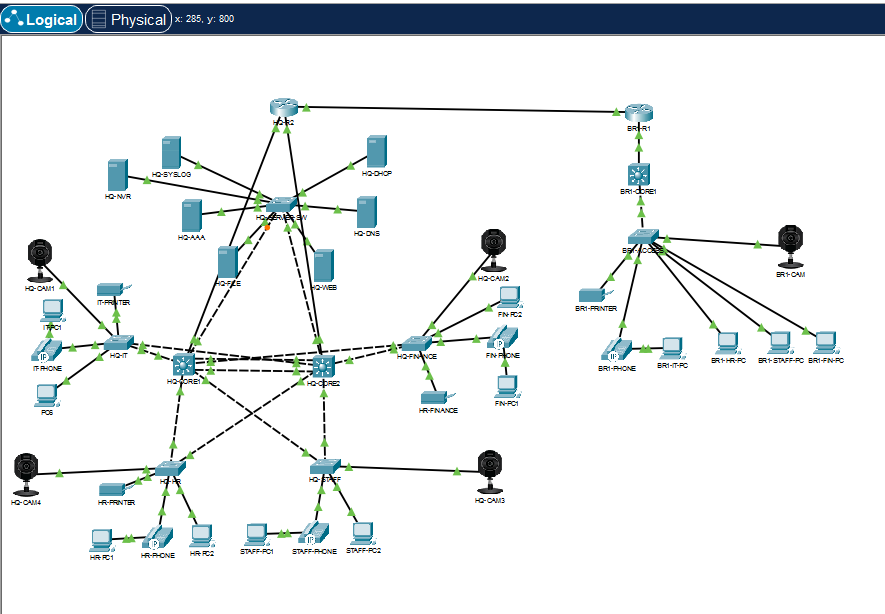
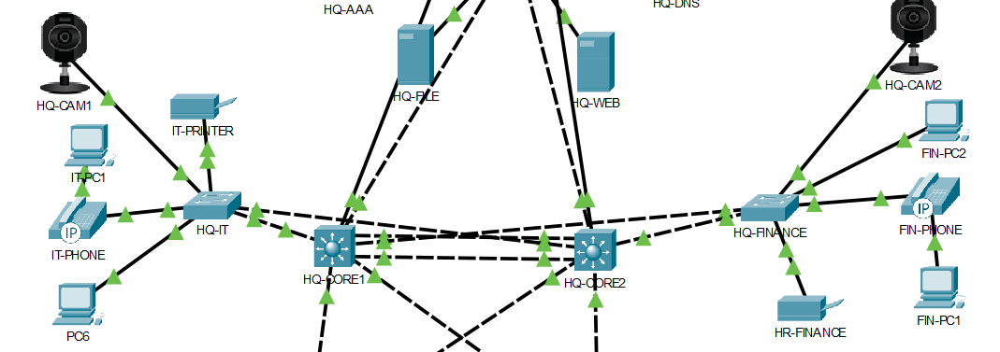
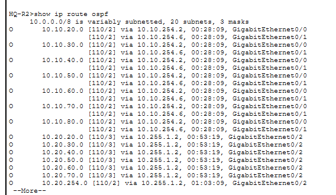
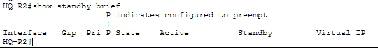
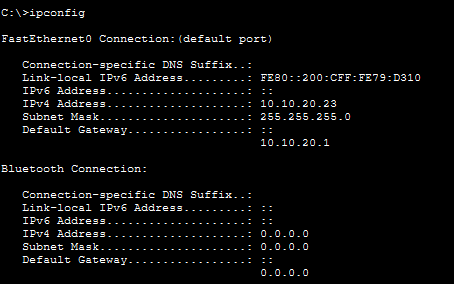
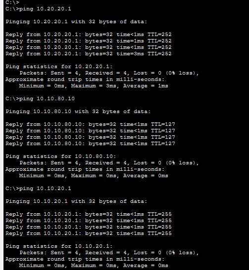
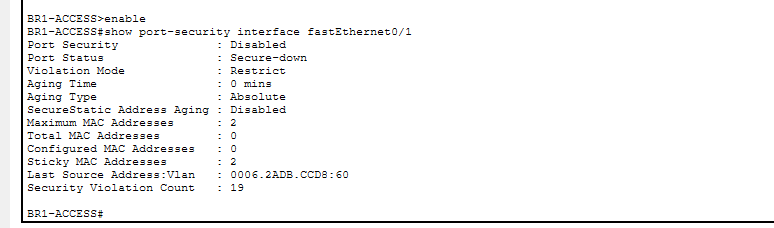
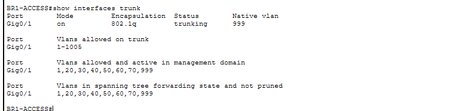

<div align="center">

# 🌐 Enterprise Multi-Site Network Lab

### Cisco enterprise network design, implementation, security & troubleshooting


A self-directed Cisco Packet Tracer project simulating a **redundant headquarters and branch-office network** with departmental segmentation, dynamic WAN routing, centralized services and Layer-2 security controls.

</div>

---

## 🗺️ Network Topology



## ✨ Project Highlights

| Area | Implementation |
|---|---|
| 🏢 Campus design | Redundant HQ core with departmental access switching |
| 🌍 WAN routing | OSPF Area 0 between HQ and Branch 1 |
| 🔁 Gateway redundancy | HSRP virtual gateways across HQ core switches |
| 🔗 Link redundancy | LACP EtherChannel between HQ cores |
| 🧩 Segmentation | IT, Finance, HR, Staff, Voice, CCTV and Server VLANs |
| 📡 Central services | DHCP, DNS, Web, File, AAA, Syslog and NVR |
| 🛡️ Security | ACLs, Port Security, DHCP Snooping, DAI, BPDU Guard |
| 🧰 Troubleshooting | OSPF, HSRP, DHCP, gateway, VLAN and port-security faults |

## 🏗️ Architecture

### Headquarters
- Dual Cisco multilayer core switches
- HSRP default-gateway redundancy
- LACP EtherChannel between core switches
- Department access switches for IT, Finance, HR and Staff
- Dedicated server access switch
- Voice and CCTV segmentation
- Central DHCP, DNS, Web, File, AAA, Syslog and NVR services

### Branch 1
- Cisco branch router
- Multilayer core switch
- Layer-2 access switch
- Departmental VLAN segmentation
- Centralized DHCP delivered from HQ using DHCP relay
- OSPF connectivity across the WAN

## 📐 Addressing Strategy

| Site | Address Space |
|---|---|
| Headquarters | `10.10.0.0/16` |
| Branch 1 | `10.20.0.0/16` |
| WAN / Transit | `10.255.0.0/16` |

### VLAN Plan

| VLAN | Purpose | HQ Gateway | Branch 1 Gateway |
|---|---|---|---|
| 20 | IT | `10.10.20.1` | `10.20.20.1` |
| 30 | Finance | `10.10.30.1` | `10.20.30.1` |
| 40 | HR | `10.10.40.1` | `10.20.40.1` |
| 50 | Staff | `10.10.50.1` | `10.20.50.1` |
| 60 | Voice | `10.10.60.1` | `10.20.60.1` |
| 70 | CCTV | `10.10.70.1` | `10.20.70.1` |
| 80 | Servers | `10.10.80.1` | — |
| 999 | Native / Blackhole | N/A | N/A |

## 🔧 Technologies Implemented

`VLANs` · `802.1Q Trunking` · `Inter-VLAN Routing` · `HSRP` · `LACP EtherChannel` · `OSPF` · `DHCP Relay` · `ACLs` · `Port Security` · `DHCP Snooping` · `Dynamic ARP Inspection` · `PortFast` · `BPDU Guard`

## 🧪 Verification Evidence

### HQ Core Redundancy


### OSPF Routing


### HSRP Status


### Branch DHCP


### Branch-to-HQ Connectivity


### Port Security


### VLAN Trunking


## 🧠 Troubleshooting Work

The project included diagnosing and resolving configuration faults rather than simply entering a known-good configuration.

Key issues resolved included:

1. OSPF routes present in the LSDB but temporarily absent from the routing table.
2. Duplicate/stale HSRP configuration copied from HQ into Branch 1.
3. Duplicate Layer-3 gateway addresses accidentally configured on the Branch access switch.
4. Branch DHCP pools using incorrect HQ subnet addresses.
5. Port-security violations involving sticky MAC learning.
6. Incorrect endpoint access-port and VLAN configuration.
7. Intermittent connectivity caused by conflicting gateway configuration.

Verification commands included:

```text
show ip route
show ip route ospf
show ip ospf neighbor
show ip ospf database
show ip interface brief
show interfaces trunk
show vlan brief
show standby brief
show port-security interface
show ip dhcp snooping
ping
```

## 📁 Documentation

- [IP Addressing Plan](documentation/ip-addressing.md)
- [Routing Design](documentation/routing-design.md)
- [Security Controls](documentation/security-controls.md)
- [Troubleshooting Notes](documentation/troubleshooting.md)
- `packet-tracer/` — working Cisco Packet Tracer lab file
- `screenshots/` — implementation and verification evidence

## 🚀 Next Development Phase

Planned evolution of the project:

**Packet Tracer → Cisco Modeling Labs → Ansible → pyATS validation → controlled deployment workflow**

Future development may include additional branches, configuration automation, automated validation and physical Cisco hardware testing.

---

<div align="center">

### Skills Demonstrated

**Cisco IOS · Enterprise Networking · Switching · Routing · OSPF · HSRP · EtherChannel · DHCP · ACLs · Layer-2 Security · Network Troubleshooting · WAN Design**

**Portfolio project by Sameer Raut**

</div>
